# Tema 10: Redes Locales

> Este tema cubre los fundamentos de las redes de comunicaciones: tipos de redes por extensión geográfica, topologías físicas, métodos de acceso al medio, técnicas de transmisión y los dispositivos de interconexión que hacen posible conectar equipos. Es el último tema del Bloque IV (Sistemas y Comunicaciones) y uno de los más examinados en oposiciones IT, tanto por su amplitud conceptual como por la variedad de preguntas prácticas que genera. El estudiante debe dominar la taxonomía de redes (LAN/MAN/WAN/PAN/CAN), las topologías y sus características, los mecanismos CSMA/CD y CSMA/CA, el funcionamiento del switch y la tabla CAM, los estándares Wi-Fi (802.11), los tipos de VLAN y el etiquetado 802.1Q, los niveles TIER del estándar TIA-942 para Centros de Proceso de Datos, y la diferencia entre los distintos dispositivos de interconexión según la capa OSI en que operan.

---

## 1. Redes Locales

Una **red de comunicaciones** es un conjunto de dispositivos interconectados que comparten recursos e información. Las redes se clasifican principalmente por su extensión geográfica.

### 1.1 Clasificación por extensión geográfica

| Tipo | Nombre completo | Extensión típica | Características principales |
|:---:|:---|:---|:---|
| **PAN** | Personal Area Network | 1–10 m | Dispositivos personales; tecnologías: Bluetooth (IEEE 802.15.1), ZigBee (IEEE 802.15.4) |
| **LAN** | Local Area Network | Edificio / campus | Alta velocidad, baja latencia, gestión privada; tecnologías: Ethernet (IEEE 802.3), Wi-Fi (IEEE 802.11) |
| **CAN** | Campus Area Network | Campus / parque tecnológico | Entre varias LAN dentro de un área delimitada; infraestructura de alta velocidad |
| **MAN** | Metropolitan Area Network | Ciudad | Conecta varias LAN en un área metropolitana; fibra óptica, alta velocidad y baja latencia |
| **WAN** | Wide Area Network | País / continente / mundial | Enlaza LAN geográficamente separadas mediante enlaces públicos o privados (cables submarinos, satélites, fibra óptica) |

La forma más sencilla de recordarlos es por cobertura creciente: PAN (tu bolsillo) → LAN (tu oficina) → CAN (tu campus) → MAN (tu ciudad) → WAN (el mundo). Cada tipo de red suele conectarse hacia arriba: varias LAN forman una MAN, varias MAN forman parte de una WAN.

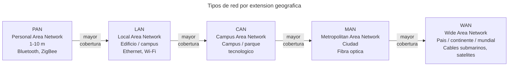
```mermaid
---
title: "Tipos de red por extension geografica"
---
flowchart LR
    PAN["PAN\nPersonal Area Network\n1-10 m\nBluetooth, ZigBee"]
    LAN["LAN\nLocal Area Network\nEdificio / campus\nEthernet, Wi-Fi"]
    CAN["CAN\nCampus Area Network\nCampus / parque\ntecnologico"]
    MAN["MAN\nMetropolitan Area Network\nCiudad\nFibra optica"]
    WAN["WAN\nWide Area Network\nPais / continente / mundial\nCables submarinos, satelites"]

    PAN -->|"mayor\ncobertura"| LAN
    LAN -->|"mayor\ncobertura"| CAN
    CAN -->|"mayor\ncobertura"| MAN
    MAN -->|"mayor\ncobertura"| WAN
```

#### 1.1.1 LAN (Local Area Network)

Una **LAN** conecta dispositivos dentro de un área geográfica limitada (casa, oficina, edificio). Sus características clave son:

- **Alta velocidad**: desde 10 Mbps (10BASE-T) hasta 100 Gbps en redes modernas.
- **Baja latencia**: la comunicación es prácticamente instantánea entre nodos.
- **Administración privada**: no depende de operadores de telecomunicaciones.
- **No requiere Internet**: puede funcionar de forma autónoma para compartir archivos, impresoras y recursos.

Existen dos variantes principales:

- **LAN cableada (Ethernet)**: utiliza cable de par trenzado y switches. Ofrece mayor estabilidad, velocidad constante y menor latencia.
- **LAN inalámbrica (Wi-Fi / WLAN)**: conecta dispositivos mediante señales de radio (IEEE 802.11). Facilita la movilidad, pero es más vulnerable a interferencias y requiere configuración de seguridad adecuada (WPA2/WPA3).

#### 1.1.2 WLAN (Wireless LAN)

Una **WLAN** es una LAN que emplea tecnologías inalámbricas. El comité **[IEEE 802.11](https://www.ieee802.org/11/)** es el responsable de sus estándares:

| Estándar | Nombre comercial | Año | Banda | Velocidad máx. teórica |
|:---:|:---:|:---:|:---:|:---:|
| 802.11b | — | 1999 | 2,4 GHz | 11 Mbps |
| 802.11a | — | 1999 | 5 GHz | 54 Mbps |
| 802.11g | — | 2003 | 2,4 GHz | 54 Mbps |
| 802.11n | Wi-Fi 4 | 2009 | 2,4 / 5 GHz | 600 Mbps |
| 802.11ac | Wi-Fi 5 | 2013 | 5 GHz | 3,5 Gbps |
| 802.11ax | **Wi-Fi 6** | 2021 | 2,4 / 5 / 6 GHz | 9,6 Gbps |
| 802.11be | Wi-Fi 7 | 2024 | 2,4 / 5 / 6 GHz | 46 Gbps |

> **Dato de examen**: IEEE 802.11ax = **Wi-Fi 6**. IEEE 802.11ac = Wi-Fi 5. IEEE 802.11be = Wi-Fi 7. El comité IEEE encargado de estándares WLAN es **IEEE 802.11** (no confundir con IEEE 802.15 —Bluetooth/ZigBee— ni con IEEE 802.16 —WiMAX—).

#### 1.1.3 VLAN (Virtual LAN)

Una **VLAN** segmenta una red física en varias redes lógicas independientes, agrupando dispositivos por función, departamento o política, independientemente de su ubicación física. Se trata en detalle en la sección 5.

#### 1.1.4 Red cableada e híbrida

- **Red cableada**: emplea cables físicos (par trenzado, coaxial o fibra óptica). Ofrece mayor estabilidad y menor latencia.
- **Red híbrida**: combina infraestructura cableada e inalámbrica para aprovechar las ventajas de ambas.

### 1.2 Componentes básicos de una red

- **Servidor**: centraliza recursos y servicios (archivos, aplicaciones, bases de datos).
- **Estación de trabajo**: dispositivo del usuario final que accede a la red.
- **Tarjeta de red (NIC, Network Interface Card)**: permite la comunicación entre el dispositivo y la red. Cada NIC tiene una **dirección MAC** de 48 bits (6 bytes), representada como **6 bloques de 2 caracteres hexadecimales** (ej.: `00:50:56:AA:BB:CC`). Los primeros 3 bytes identifican al fabricante (**OUI**, Organizationally Unique Identifier); los últimos 3 bytes son el identificador del dispositivo.

#### 1.2.1 Tipos de cable

Tres son los tipos de cable más usados en redes locales:

| Cable | Descripción | Uso típico |
|:---|:---|:---|
| **Fibra óptica** | Transmite datos mediante pulsos de luz; inmune a interferencias electromagnéticas | Backbone, largas distancias, alta velocidad |
| **Cable coaxial** | Conductor central rodeado de blindaje metálico | Redes antiguas (10BASE2/10BASE5), televisión por cable |
| **Par trenzado** | Pares de cables trenzados para reducir interferencias; tipos UTP/STP | LAN modernas (Cat5e, Cat6, Cat6A) |

### 1.5 Protocolos fundamentales: TCP e IP

La suite de protocolos **TCP/IP** constituye la base de las comunicaciones en Internet y en la mayoría de redes locales. Se compone de dos protocolos principales con funciones diferenciadas y complementarias:

#### TCP (Transmission Control Protocol)

**TCP** es un protocolo de la **capa de transporte** (capa 4 del modelo OSI) que se encarga del manejo fiable de los datos:

- **Orientado a conexión**: establece una conexión entre emisor y receptor antes de transmitir datos (three-way handshake: SYN, SYN-ACK, ACK):

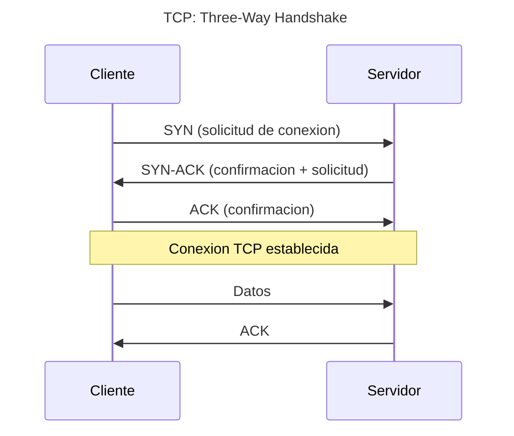
```mermaid
---
title: "TCP: Three-Way Handshake"
---
sequenceDiagram
    participant C as Cliente
    participant S as Servidor

    C->>S: SYN (solicitud de conexion)
    S->>C: SYN-ACK (confirmacion + solicitud)
    C->>S: ACK (confirmacion)
    Note over C,S: Conexion TCP establecida
    C->>S: Datos
    S->>C: ACK
```

- **Fiable**: garantiza la entrega ordenada de los datos; detecta y retransmite paquetes perdidos o dañados.
- **Control de errores**: verifica la integridad de los datos mediante sumas de comprobación (checksums).
- **Control de flujo**: regula la velocidad de transmisión para evitar que el receptor se sature.
- **Control de congestión**: ajusta la tasa de envío según el estado de la red.

#### IP (Internet Protocol)

**IP** es un protocolo de la **capa de red** (capa 3 del modelo OSI) que se encarga de transportar los paquetes de datos de un lugar a otro:

- **Sin conexión**: cada paquete (datagrama) se envía de forma independiente, sin establecer una conexión previa.
- **Direccionamiento**: asigna direcciones lógicas (IPv4 de 32 bits o IPv6 de 128 bits) a los dispositivos de la red.
- **Enrutamiento**: determina la ruta que debe seguir cada paquete para llegar desde el origen hasta el destino, a través de los routers intermedios.
- **Best-effort delivery** (entrega de mejor esfuerzo): IP no garantiza la entrega de los paquetes ni su orden de llegada; esa responsabilidad recae en TCP.

#### Resumen comparativo TCP vs IP

| Característica | TCP | IP |
|:---|:---:|:---:|
| Capa OSI | Transporte (capa 4) | Red (capa 3) |
| Función principal | Manejar datos y comprobar errores en la transmisión | Transportar paquetes de un lugar a otro |
| Orientación | Orientado a conexión | Sin conexión |
| Fiabilidad | Fiable (retransmisión, control de errores) | No fiable (best-effort) |
| Unidad de datos | Segmento | Datagrama |

> **Dato de examen**: **TCP** (1) es el encargado de manejar datos y comprobar si existen errores en la transmisión; **IP** (2) se encarga de transportar los paquetes de datos de un lugar a otro. No confundir sus funciones.

---

## 2. Topologías de Red

La **topología** de una red describe la estructura o disposición de sus nodos y enlaces. Se distingue entre topología física (disposición real del cableado) y topología lógica (cómo fluyen los datos).

Hay ocho topologías que debes conocer: Bus, Estrella, Mixta, Anillo, Doble Anillo, Árbol, Malla parcial y Malla total (Totalmente Conexa).

### 2.1 Comparativa de topologías

| Topología | Descripción | Ventajas | Desventajas |
|:---:|:---|:---|:---|
| **Bus** | Todos los dispositivos comparten un único cable central | Sencilla, bajo coste de instalación | Eficiencia disminuye con más nodos; un fallo en el bus afecta a toda la red |
| **Estrella** | Todos los nodos se conectan a un dispositivo central (switch/hub) mediante enlace punto a punto | Fácil de gestionar y diagnosticar; un fallo en un nodo no afecta al resto | Si el dispositivo central falla, toda la red queda inactiva |
| **Anillo** | Cada nodo conecta al siguiente formando un círculo cerrado; los datos circulan en una dirección | El orden de los datos se mantiene; sin colisiones | Un fallo en un nodo puede afectar a toda la red |
| **Doble anillo** | Dos anillos concéntricos; el segundo actúa como respaldo | Alta disponibilidad (FDDI usa esta topología) | Mayor coste y complejidad |
| **Árbol (jerárquica)** | Estructura jerárquica ramificada a partir de un nodo raíz | Facilita la expansión añadiendo ramas | Dependencia del nodo raíz; su fallo afecta a toda la red |
| **Malla parcial** | Cada nodo conecta a varios (pero no todos) los demás | Mayor redundancia que bus/estrella | Coste moderado-alto de implementación |
| **Malla total (Totalmente Conexa)** | Cada nodo conecta a todos los demás | Máxima redundancia y tolerancia a fallos | Coste muy elevado por la cantidad de enlaces necesarios |
| **Mixta / Híbrida** | Combinación de dos o más topologías | Flexibilidad para adaptarse a distintos entornos | Mayor complejidad de gestión |

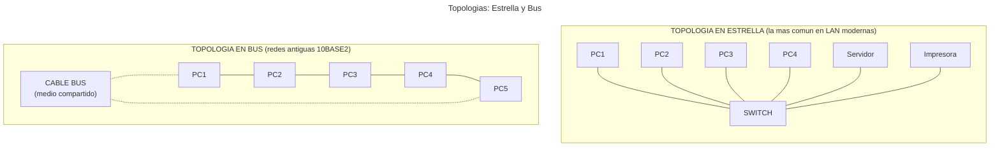
```mermaid
---
title: "Topologias: Estrella y Bus"
---
flowchart TD
    subgraph S1["TOPOLOGIA EN ESTRELLA (la mas comun en LAN modernas)"]
        direction TD
        SW[SWITCH]
        P1["PC1"] --- SW
        P2["PC2"] --- SW
        P3["PC3"] --- SW
        P4["PC4"] --- SW
        SRV["Servidor"] --- SW
        IMP["Impresora"] --- SW
    end

    subgraph S2["TOPOLOGIA EN BUS (redes antiguas 10BASE2)"]
        direction LR
        B1["PC1"] --- B2["PC2"]
        B2 --- B3["PC3"]
        B3 --- B4["PC4"]
        B4 --- B5["PC5"]
        BUS["CABLE BUS\n(medio compartido)"] -..- B1
        BUS -..- B5
    end
```

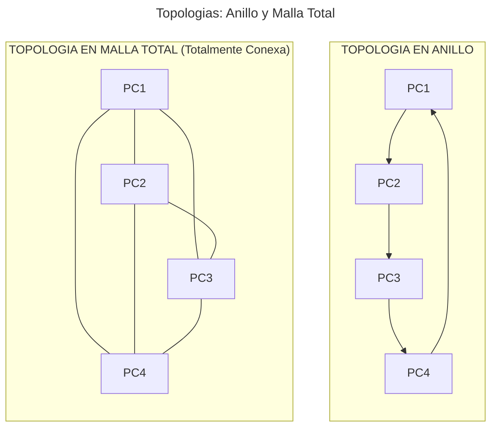
```mermaid
---
title: "Topologias: Anillo y Malla Total"
---
flowchart TD
    subgraph S1["TOPOLOGIA EN ANILLO"]
        direction TD
        R1["PC1"] --> R2["PC2"]
        R2 --> R3["PC3"]
        R3 --> R4["PC4"]
        R4 --> R1
    end

    subgraph S2["TOPOLOGIA EN MALLA TOTAL (Totalmente Conexa)"]
        direction TD
        M1["PC1"] --- M2["PC2"]
        M1 --- M3["PC3"]
        M1 --- M4["PC4"]
        M2 --- M3
        M2 --- M4
        M3 --- M4
    end
```

> **Dato de examen**: En la topología en **estrella**, todos los elementos se conectan mediante enlace punto a punto al equipo central. En el **anillo**, los datos describen una trayectoria circular. En el **bus**, los dispositivos se disponen linealmente sobre un cable compartido.

### 2.2 Red inalámbrica Wi-Fi (topología)

En Wi-Fi existen dos esquemas principales: la topología en **infraestructura** (todos los clientes se conectan a un punto de acceso central, como la estrella cableada) y el modo **ad-hoc** (los dispositivos se comunican directamente entre sí sin AP). El más usado en empresa es el modo infraestructura.

Cuando hay varios APs, sus celdas de cobertura se solapan un 10–15 % para permitir el **roaming**: el dispositivo móvil se desconecta de un AP y se conecta al siguiente sin perder la sesión. El AP raíz conecta con la troncal Ethernet; los APs repetidores extienden la cobertura.

**Desventaja principal**: menor seguridad si no se configura correctamente (requiere WPA2 o WPA3 como mínimo).

### 2.3 Red Ethernet en bus (estándares históricos)

La red Ethernet original se implementaba sobre bus coaxial. Los estándares históricos son:

| Estándar | Medio | Velocidad | Distancia máx. |
|:---:|:---:|:---:|:---:|
| 10Base5 | Coaxial grueso | 10 Mbps | 500 m |
| 10Base2 | Coaxial fino | 10 Mbps | 185 m |
| 10Base-T | Par trenzado (Cat3) | 10 Mbps | 100 m |
| 10Base-F | Fibra óptica | 10 Mbps | 2000 m |
| 100Base-TX | Par trenzado (Cat5) | 100 Mbps | 100 m |
| 100Base-FX | Fibra óptica | 100 Mbps | 2000 m |

El hardware empleado en estas redes incluye: **NIC** (adaptador de red), **repetidor**, **concentrador (hub)**, **puente (bridge)**, **conmutador (switch)** y **enrutador (router)**.

### 2.4 Topología celular

La **topología celular** (o **red celular**) es una arquitectura de red inalámbrica en la que el área geográfica de cobertura se divide en regiones denominadas **celdas**, cada una de las cuales tiene un **nodo individual** (estación base) en el centro.

**Características principales:**

- Las celdas se representan como **áreas circulares o hexagonales**. La forma hexagonal es la más utilizada en los modelos teóricos porque cubre un área sin dejar huecos y con un mínimo de solapamiento, facilitando el análisis del sistema.
- Cada celda dispone de una **estación base** (*Base Transceiver Station*, BTS) que gestiona las comunicaciones de todos los dispositivos dentro de su área de cobertura.
- A cada celda se le asigna un conjunto de **frecuencias** que puede reutilizarse en otras celdas no adyacentes, maximizando la capacidad del sistema sin interferencias cocanal.
- Las celdas adyacentes **no comparten las mismas frecuencias** para evitar interferencias.

**Handoff (o Handover):**

Cuando un dispositivo móvil se desplaza de una celda a otra, se produce un proceso de transferencia denominado **handoff** (o **handover**):

- El terminal evalúa periódicamente la señal de las estaciones base cercanas.
- Cuando la señal de otra estación base es más fuerte que la actual, se inicia la transferencia.
- El proceso es transparente para el usuario: la comunicación no se interrumpe durante el cambio.

**Tipos de handoff:**
- Entre canales dentro de la misma celda.
- Entre celdas (BTS) dentro del mismo controlador (BSC).
- Entre celdas de diferentes controladores pero del mismo conmutador (MSC).
- Entre celdas de diferentes conmutadores (MSC).

**Aplicaciones:**
- Redes de telefonía móvil (GSM, UMTS, LTE, 5G).
- Redes de datos móviles.
- Sistemas de comunicación inalámbrica de área extensa.

> **Dato de examen**: La topología celular está compuesta por **áreas circulares o hexagonales**, cada una con un **nodo individual en el centro** (estación base). Es la topología utilizada en redes de telefonía móvil. No confundir con topología en estrella (nodo central con enlaces punto a punto cableados) ni con topología en malla.

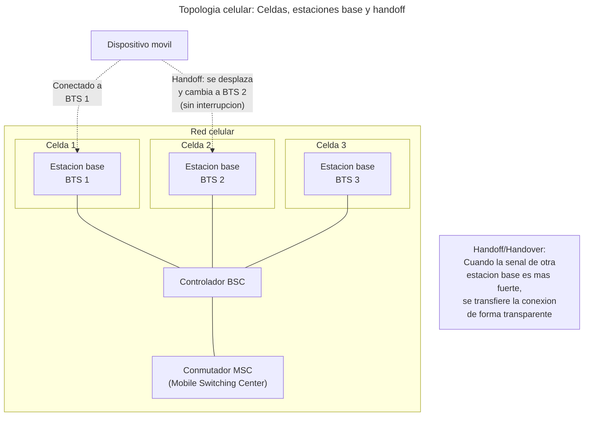
```mermaid
---
title: "Topologia celular: Celdas, estaciones base y handoff"
---
flowchart TD
    subgraph NET["Red celular"]
        direction TD
        subgraph C1["Celda 1\n(frecuencias F1)"]
            BTS1["Estacion base\nBTS 1"]
        end
        subgraph C2["Celda 2\n(frecuencias F2)"]
            BTS2["Estacion base\nBTS 2"]
        end
        subgraph C3["Celda 3\n(frecuencias F3)"]
            BTS3["Estacion base\nBTS 3"]
        end

        BTS1 --- BSC["Controlador BSC"]
        BTS2 --- BSC
        BTS3 --- BSC
        BSC --- MSC["Conmutador MSC\n(Mobile Switching Center)"]
    end

    MOV["Dispositivo movil"] -.->|"Conectado a\nBTS 1"| BTS1
    MOV -.->|"Handoff: se desplaza\ny cambia a BTS 2\n(sin interrupcion)"| BTS2

    NOTE["Handoff/Handover:\nCuando la senal de otra\nestacion base es mas fuerte,\nse transfiere la conexion\nde forma transparente"]
    NOTE ~~~ MSC
```

---

## 3. Métodos de Acceso al Medio

Cuando varios dispositivos comparten el mismo medio de transmisión, necesitan un árbitro: algo que decida quién habla y cuándo. Si no lo hubiera, todos hablarían a la vez y las señales se mezclarían. El **método de acceso al medio** es precisamente ese árbitro.

### 3.1 Sondeo o Polling

La idea más simple: un **controlador central** pregunta a cada dispositivo, uno por uno, si tiene datos para enviar. Solo transmite el que recibe permiso del controlador.

- **Ventaja**: elimina las colisiones porque nunca transmiten dos a la vez.
- **Desventaja**: si hay muchos dispositivos, los últimos en ser consultados esperan mucho; además el controlador central es un punto único de fallo.

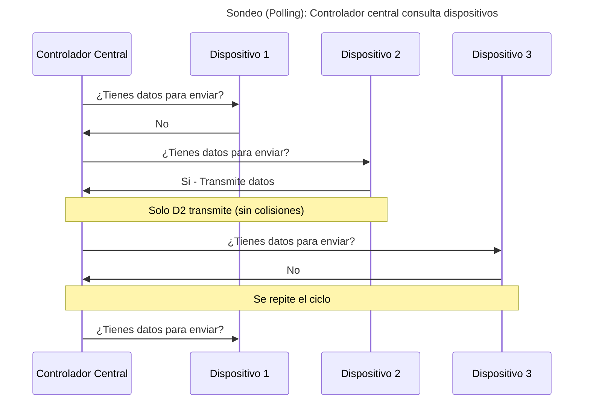
```mermaid
---
title: "Sondeo (Polling): Controlador central consulta dispositivos"
---
sequenceDiagram
    participant CTR as Controlador Central
    participant D1 as Dispositivo 1
    participant D2 as Dispositivo 2
    participant D3 as Dispositivo 3

    CTR->>D1: ¿Tienes datos para enviar?
    D1->>CTR: No
    CTR->>D2: ¿Tienes datos para enviar?
    D2->>CTR: Si - Transmite datos
    Note over CTR,D2: Solo D2 transmite (sin colisiones)
    CTR->>D3: ¿Tienes datos para enviar?
    D3->>CTR: No
    Note over CTR,D3: Se repite el ciclo
    CTR->>D1: ¿Tienes datos para enviar?
```

### 3.2 Pase de testigo (Token Passing)

Un **token** (testigo) circula entre los dispositivos; únicamente el que posee el token puede transmitir en ese momento.

Imagina que cuatro equipos (A, B, C, D) se pasan el token en orden circular: solo el que tiene el token puede hablar, y cuando termina lo pasa al siguiente.

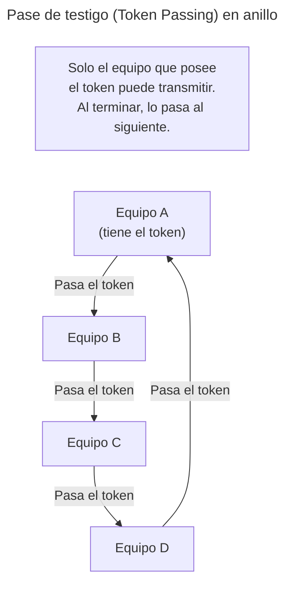
```mermaid
---
title: "Pase de testigo (Token Passing) en anillo"
---
flowchart TD
    A["Equipo A\n(tiene el token)"] -->|"Pasa el token"| B["Equipo B"]
    B -->|"Pasa el token"| C["Equipo C"]
    C -->|"Pasa el token"| D["Equipo D"]
    D -->|"Pasa el token"| A

    NOTE["Solo el equipo que posee\nel token puede transmitir.\nAl terminar, lo pasa al siguiente."]
    NOTE ~~~ A
```

#### 3.2.1 Token Ring (pase de testigo en anillo)

El token circula por una topología en anillo. Ordenado y predecible; cada nodo espera su turno.

- **Ventaja**: ordenado y predecible; sin colisiones.
- **Desventaja**: vulnerable a la pérdida del token (si se pierde, la comunicación se detiene) y a que un nodo caído rompa el anillo.

#### 3.2.2 Pase de testigo en bus

El token circula por una red en bus lógico (aunque el medio físico pueda ser diferente). Base tecnológica de redes como **FDDI** (Fiber Distributed Data Interface).

- **Ventaja**: facilita el control del acceso al canal.
- **Desventaja**: eficiencia disminuye con más nodos.

### 3.3 CSMA — Acceso Múltiple con Detección de Portadora

**CSMA** (Carrier Sense Multiple Access) es el mecanismo empleado en Ethernet y Wi-Fi. Los dispositivos "escuchan" el canal antes de transmitir.

#### 3.3.1 CSMA/CD (Collision Detection) — Ethernet, IEEE 802.3

Usado en **Ethernet** tradicional (redes con hub o bus coaxial). El proceso es:

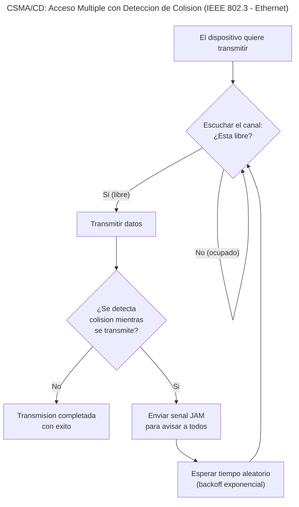
```mermaid
---
title: "CSMA/CD: Acceso Multiple con Deteccion de Colision (IEEE 802.3 - Ethernet)"
---
flowchart TD
    A["El dispositivo quiere transmitir"] --> B{"Escuchar el canal:\n¿Esta libre?"}
    B -- "No (ocupado)" --> B
    B -- "Si (libre)" --> C["Transmitir datos"]
    C --> D{"¿Se detecta\ncolision mientras\nse transmite?"}
    D -- "No" --> E["Transmision completada\ncon exito"]
    D -- "Si" --> F["Enviar senal JAM\npara avisar a todos"]
    F --> G["Esperar tiempo aleatorio\n(backoff exponencial)"]
    G --> B
```

Visualízalo así: en una red en bus, dos equipos transmiten simultáneamente, sus señales chocan (colisión), ambos detectan el choque y retroceden esperando un tiempo aleatorio antes de volver a intentarlo.

- **Dominio de colisión**: segmento de red donde dos dispositivos pueden causar una colisión. Los **switches** separan dominios de colisión (cada puerto es un dominio de colisión independiente). Los **hubs** no los separan.
- **Dominio de broadcast**: segmento donde un broadcast llega a todos los dispositivos. Los **routers** separan dominios de broadcast. Los switches (sin VLANs) no los separan.

> **Regla fundamental**: el **switch** separa dominios de colisión pero NO dominios de broadcast. El **router** separa ambos. El tráfico **broadcast** no traspasa el router (queda confinado dentro de su dominio de broadcast).

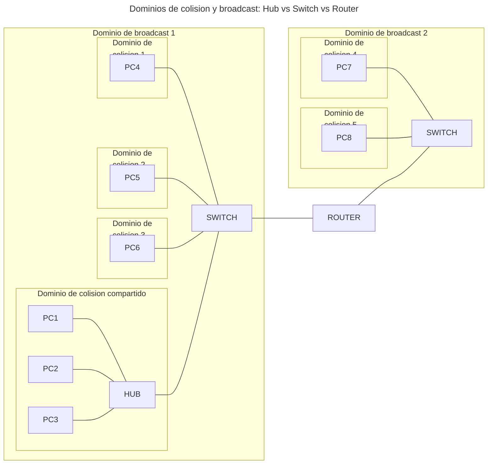
```mermaid
---
title: "Dominios de colision y broadcast: Hub vs Switch vs Router"
---
flowchart LR
    subgraph BD1["Dominio de broadcast 1"]
        subgraph CD1["Dominio de colision compartido"]
            H["HUB"]
            HP1["PC1"] --- H
            HP2["PC2"] --- H
            HP3["PC3"] --- H
        end

        subgraph CD2["Dominio de\ncolision 1"]
            SP1["PC4"]
        end
        subgraph CD3["Dominio de\ncolision 2"]
            SP2["PC5"]
        end
        subgraph CD4["Dominio de\ncolision 3"]
            SP3["PC6"]
        end

        S["SWITCH"]
        SP1 --- S
        SP2 --- S
        SP3 --- S
        H --- S
    end

    R["ROUTER"]
    S --- R

    subgraph BD2["Dominio de broadcast 2"]
        subgraph CD5["Dominio de\ncolision 4"]
            RP1["PC7"]
        end
        subgraph CD6["Dominio de\ncolision 5"]
            RP2["PC8"]
        end

        S2["SWITCH"]
        RP1 --- S2
        RP2 --- S2
    end

    R --- S2
```

#### 3.3.2 CSMA/CA (Collision Avoidance) — Wi-Fi, IEEE 802.11

Usado en **redes Wi-Fi**. No puede detectar colisiones (el medio inalámbrico no lo permite), así que las **evita** antes de transmitir:

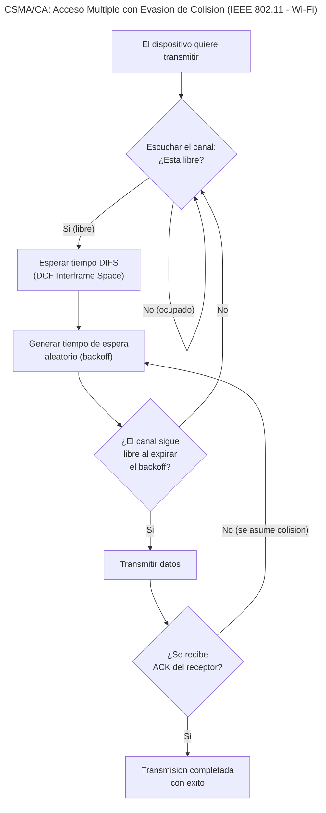
```mermaid
---
title: "CSMA/CA: Acceso Multiple con Evasion de Colision (IEEE 802.11 - Wi-Fi)"
---
flowchart TD
    A["El dispositivo quiere transmitir"] --> B{"Escuchar el canal:\n¿Esta libre?"}
    B -- "No (ocupado)" --> B
    B -- "Si (libre)" --> C["Esperar tiempo DIFS\n(DCF Interframe Space)"]
    C --> D["Generar tiempo de espera\naleatorio (backoff)"]
    D --> E{"¿El canal sigue\nlibre al expirar\nel backoff?"}
    E -- "No" --> B
    E -- "Si" --> F["Transmitir datos"]
    F --> G{"¿Se recibe\nACK del receptor?"}
    G -- "Si" --> H["Transmision completada\ncon exito"]
    G -- "No (se asume colision)" --> D
```

Opcionalmente usa **RTS/CTS** (Request to Send / Clear to Send) para evitar el problema del **nodo oculto**: cuando dos dispositivos no se "ven" entre sí pero ambos ven el AP, pueden transmitir a la vez y colisionar en el AP sin saberlo. Con RTS/CTS, el dispositivo primero pide permiso (RTS), el AP responde con CTS avisando a todos, y solo entonces el dispositivo transmite.

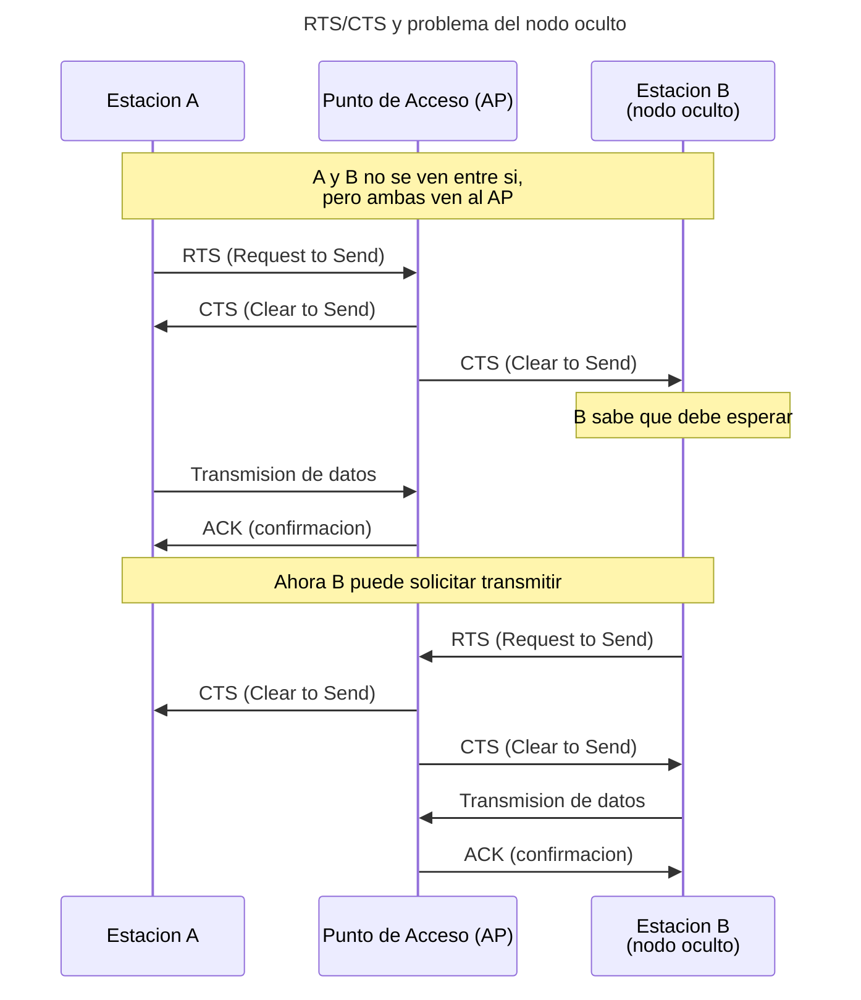
```mermaid
---
title: "RTS/CTS y problema del nodo oculto"
---
sequenceDiagram
    participant A as Estacion A
    participant AP as Punto de Acceso (AP)
    participant B as Estacion B<br>(nodo oculto)

    Note over A,B: A y B no se ven entre si,<br>pero ambas ven al AP
    A->>AP: RTS (Request to Send)
    AP->>A: CTS (Clear to Send)
    AP->>B: CTS (Clear to Send)
    Note over B: B sabe que debe esperar
    A->>AP: Transmision de datos
    AP->>A: ACK (confirmacion)
    Note over A,B: Ahora B puede solicitar transmitir
    B->>AP: RTS (Request to Send)
    AP->>A: CTS (Clear to Send)
    AP->>B: CTS (Clear to Send)
    B->>AP: Transmision de datos
    AP->>B: ACK (confirmacion)
```

#### 3.3.3 Comparativa CSMA/CD vs CSMA/CA

| Característica | CSMA/CD | CSMA/CA |
|:---|:---:|:---:|
| Estándar | IEEE 802.3 (Ethernet) | IEEE 802.11 (Wi-Fi) |
| Medio | Cableado | Inalámbrico |
| Estrategia | Detecta la colisión y reintenta | Evita la colisión antes de transmitir |
| Backoff | Exponencial aleatorio tras colisión | Aleatorio antes de transmitir |
| Confirmación | No (la colisión se detecta en el medio) | Sí (ACK por cada trama) |
| Eficiencia | Alta en redes con poco tráfico | Mayor overhead que CD (ACKs + esperas previas) |

#### 3.3.4 Otras variantes CSMA

- **CSMA/NP** (Non-Persistent): si el canal está ocupado, espera un tiempo aleatorio antes de volver a escuchar.
- **CSMA/PP** (p-Persistent): si el canal está libre, transmite con probabilidad p; con probabilidad (1-p) espera un slot de tiempo.

### 3.4 Expansión del espectro en IEEE 802.11

El estándar IEEE 802.11 utiliza técnicas de expansión del espectro para distribuir la señal y hacerla más robusta frente a interferencias:

- **DSSS** (Direct Sequence Spread Spectrum): cada bit se codifica multiplicándolo por una secuencia de chips pseudoaleatoria, distribuyendo la señal sobre una banda ancha. Usado en 802.11b.
- **FHSS** (Frequency Hopping Spread Spectrum): la señal salta entre frecuencias de forma pseudoaleatoria según un patrón conocido por emisor y receptor.
- **OFDM** (Orthogonal Frequency-Division Multiplexing): no es spread spectrum, sino modulación multiportadora; utilizado en 802.11a/g/n/ac/ax.

> **Dato de examen**: el sistema de expansión del espectro de IEEE 802.11 es **DSSS** (Direct Sequence Spread Spectrum). No confundir con OFDM, que es una técnica de modulación, ni con los acrónimos inventados DMSS o OFSS.

---

## 4. Técnicas de Transmisión

Una vez que sabemos cómo se accede al medio, hay que entender cómo se organiza la transmisión en sí: si emisor y receptor se sincronizan con un reloj común (síncrona) o cada byte lleva su propia señal de inicio/parada (asíncrona); si la comunicación es en una o dos direcciones; y cómo se aprovecha mejor el ancho de banda compartiendo el canal entre varias señales.

### 4.1 Transmisión síncrona vs asíncrona

| Característica | Transmisión síncrona | Transmisión asíncrona |
|:---|:---:|:---:|
| Sincronización | Reloj compartido entre emisor y receptor | No requiere reloj sincronizado |
| Unidad de transmisión | Tramas continuas de datos | Bytes individuales con bits de control |
| Bits de control por byte | No (reduce overhead) | Sí: bit de inicio + bit(s) de parada |
| Eficiencia | Mayor (menos overhead) | Menor (mayor overhead) |
| Velocidad | Alta; adecuada para grandes volúmenes | Menor; adecuada para datos esporádicos |
| Complejidad | Mayor (requiere sincronización constante) | Menor (más fácil de implementar) |
| Usos típicos | Fibra óptica, voz/vídeo en tiempo real | Comunicación serial, teclados, ratones |

### 4.2 Modos de transmisión de datos (dúplex)

| Modo | Descripción | Ejemplo |
|:---:|:---|:---|
| **Simplex** | Transmisión unidireccional; los datos solo viajan en una dirección | Sensores, señales de TV, teclados |
| **Half-Duplex** | Bidireccional, pero solo una dirección a la vez | Walkie-talkies, Ethernet con hub (CSMA/CD) |
| **Full-Duplex** | Bidireccional simultánea; emisión y recepción al mismo tiempo | Ethernet con switch, telefonía, conexiones modernas |

> Los switches modernos operan en **full-duplex**, lo que elimina las colisiones en cada segmento puerto-dispositivo y hace que CSMA/CD sea innecesario en redes conmutadas actuales.

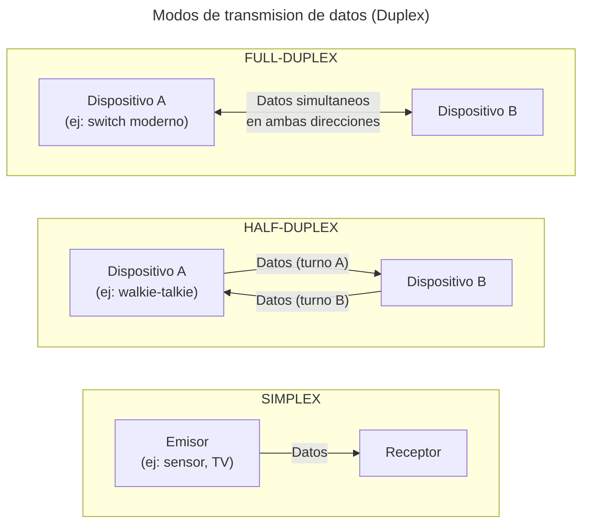
```mermaid
---
title: "Modos de transmision de datos (Duplex)"
---
flowchart LR
    subgraph S1["SIMPLEX"]
        direction LR
        SA["Emisor\n(ej: sensor, TV)"] -->|"Datos"| SB["Receptor"]
    end

    subgraph S2["HALF-DUPLEX"]
        direction LR
        HA["Dispositivo A\n(ej: walkie-talkie)"] -->|"Datos (turno A)"| HB["Dispositivo B"]
        HB -->|"Datos (turno B)"| HA
    end

    subgraph S3["FULL-DUPLEX"]
        direction LR
        FA["Dispositivo A\n(ej: switch moderno)"] <-->|"Datos simultaneos\nen ambas direcciones"| FB["Dispositivo B"]
    end
```

### 4.3 Multiplexación

La **multiplexación** permite combinar varias señales en un solo canal de transmisión para aprovechar el ancho de banda disponible de forma más eficiente.

| Tipo | Nombre completo | Principio | Uso típico |
|:---:|:---|:---|:---|
| **FDM** | Frequency Division Multiplexing | Divide el ancho de banda en subcanales de frecuencia | Radio FM, cable coaxial |
| **TDM** | Time Division Multiplexing | Asigna intervalos de tiempo fijos a cada señal | Telefonía digital (T1/E1) |
| **WDM** | Wavelength Division Multiplexing | Múltiples longitudes de onda en una fibra óptica | Redes de fibra óptica (DWDM) |
| **CDM** | Code Division Multiplexing | Códigos únicos para separar señales en el mismo espectro | Telefonía móvil (CDMA) |

- **Ventaja**: uso simultáneo de un único canal para múltiples transmisiones.
- **Desventaja**: puede ser complejo de implementar; la calidad puede degradarse si no se gestiona correctamente.

### 4.4 Conmutación

La **conmutación** es el proceso de dirigir los datos a través de los nodos de la red hasta su destino.

| Tipo | Descripción | Uso típico |
|:---:|:---|:---|
| **Conmutación de circuitos** | Establece un camino dedicado entre emisor y receptor antes de transmitir | Telefonía tradicional (PSTN) |
| **Conmutación de paquetes** | Los datos se dividen en paquetes que viajan por la red de forma independiente, pudiendo seguir diferentes rutas | Internet, redes de datos |
| **Conmutación de celdas** | Celdas de tamaño fijo (53 bytes en ATM) para garantizar calidad de servicio | ATM (Asynchronous Transfer Mode), transporte de vídeo |

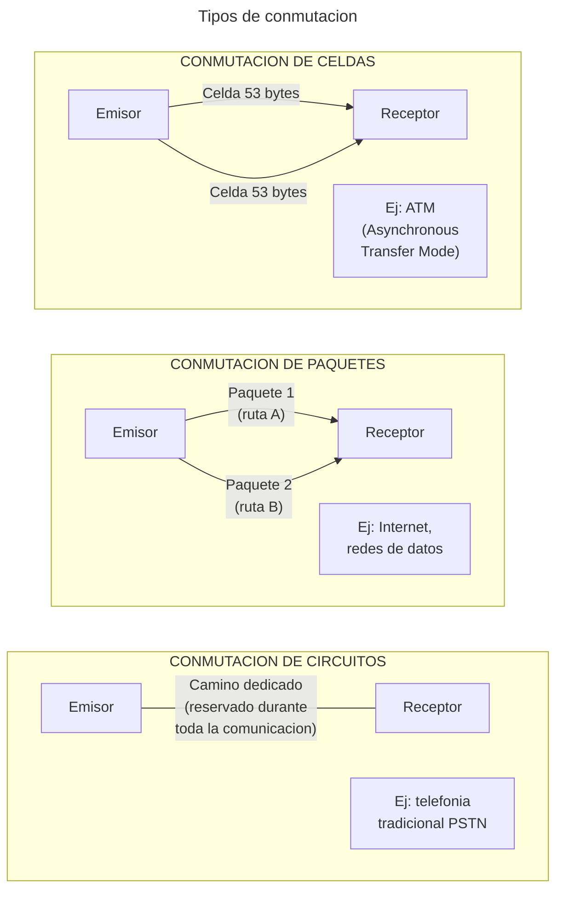
```mermaid
---
title: "Tipos de conmutacion"
---
flowchart LR
    subgraph S1["CONMUTACION DE CIRCUITOS"]
        direction LR
        CA["Emisor"] ---|"Camino dedicado\n(reservado durante\ntoda la comunicacion)"| CB["Receptor"]
        CN1["Ej: telefonia\ntradicional PSTN"]
    end

    subgraph S2["CONMUTACION DE PAQUETES"]
        direction LR
        PA["Emisor"] -->|"Paquete 1\n(ruta A)"| PB["Receptor"]
        PA -->|"Paquete 2\n(ruta B)"| PB
        PN1["Ej: Internet,\nredes de datos"]
    end

    subgraph S3["CONMUTACION DE CELDAS"]
        direction LR
        EA["Emisor"] -->|"Celda 53 bytes"| EB["Receptor"]
        EA -->|"Celda 53 bytes"| EB
        EN1["Ej: ATM\n(Asynchronous\nTransfer Mode)"]
    end
```

### 4.5 Banda base vs banda ancha

- **Banda base**: la señal digital ocupa todo el ancho de banda del medio (ej.: Ethernet). Un solo canal de comunicación.
- **Banda ancha**: el ancho de banda se divide en múltiples canales de frecuencia (ej.: ADSL, cable coaxial de TV). Permite transmisión simultánea de varios tipos de señales.

---

## 5. Dispositivos de Interconexión

Saber en qué capa OSI opera cada dispositivo es fundamental porque determina qué "entiende" y qué puede hacer: un hub no sabe qué hay en los bytes que reenvía, un switch sabe leer las MACs pero no las IPs, y un router entiende las IPs y puede decidir a qué red mandar cada paquete. Cuanta más capa, más inteligencia y más control; pero también más coste y latencia.

Los dispositivos de interconexión conectan segmentos de red y operan en distintas capas del **modelo OSI** (Open Systems Interconnection):

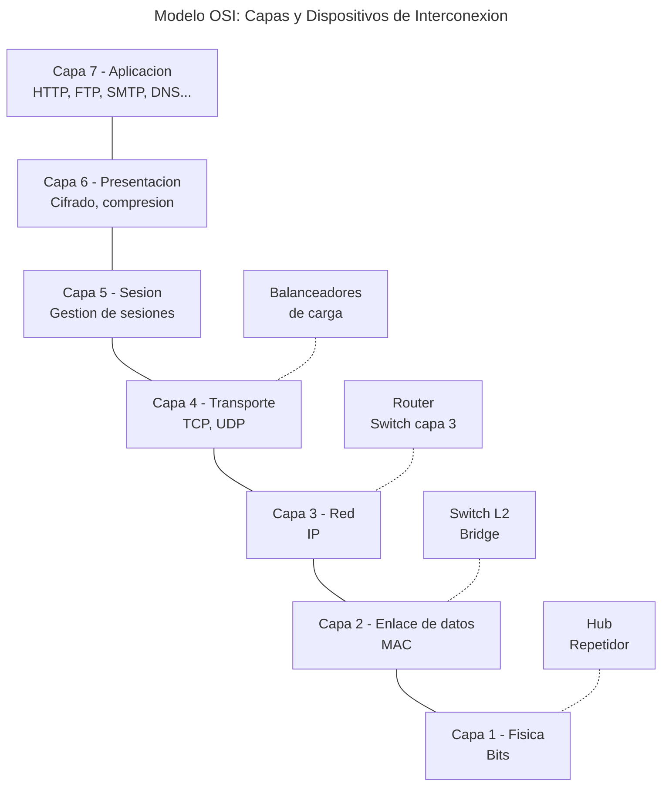
```mermaid
---
title: "Modelo OSI: Capas y Dispositivos de Interconexion"
---
flowchart TD
    L7["Capa 7 - Aplicacion\nHTTP, FTP, SMTP, DNS..."]
    L6["Capa 6 - Presentacion\nCifrado, compresion"]
    L5["Capa 5 - Sesion\nGestion de sesiones"]
    L4["Capa 4 - Transporte\nTCP, UDP"]
    L3["Capa 3 - Red\nIP"]
    L2["Capa 2 - Enlace de datos\nMAC"]
    L1["Capa 1 - Fisica\nBits"]

    L7 --- L6
    L6 --- L5
    L5 --- L4
    L4 --- L3
    L3 --- L2
    L2 --- L1

    D4["Balanceadores\nde carga"] -.- L4
    D3["Router\nSwitch capa 3"] -.- L3
    D2["Switch L2\nBridge"] -.- L2
    D1["Hub\nRepetidor"] -.- L1
```

### 5.1 Repetidor

Dispositivo de **capa 1 (Física)**. Regenera y amplía la señal eléctrica u óptica para extender la cobertura de un segmento de red, superando la limitación de distancia del medio físico.

- **Uso**: extender la cobertura de redes cableadas sin introducir inteligencia de enrutamiento.
- **Limitación**: no filtra el tráfico; amplifica también el ruido.

### 5.2 Hub (Concentrador)

Dispositivo de **capa 1 (Física)**. Dispositivo básico multipuerto: cuando recibe una trama por un puerto, la replica eléctricamente a **todos los demás puertos**. No tiene inteligencia; no conoce las direcciones MAC.

- **Uso**: redes pequeñas con poco tráfico (actualmente obsoleto).
- **Limitación**: todos los dispositivos conectados comparten el mismo dominio de colisión; solo puede operar en half-duplex.

> **Diferencia clave switch vs hub**: el switch envía la trama únicamente al puerto del destinatario (consultando su tabla MAC); el hub la envía a todos los puertos excepto el de entrada. El hub almacena nada; el switch almacena las MACs en su tabla CAM (memoria volátil).

### 5.3 Bridge (Puente)

Dispositivo de **capa 2 (Enlace de datos)**. Conecta dos segmentos de red para que funcionen como uno solo, filtrando el tráfico según las direcciones MAC. Antecedente directo del switch.

- **Uso**: segmentar redes para reducir la congestión; conectar dos LAN de igual o diferente tecnología.

### 5.4 Switch (Conmutador)

Dispositivo de **capa 2 (Enlace de datos)**, aunque existen también switches de **capa 3** con capacidades de enrutamiento.

#### 5.4.1 Funcionamiento — Tabla CAM

El switch aprende las direcciones MAC y las almacena en su **tabla CAM** (Content Addressable Memory):

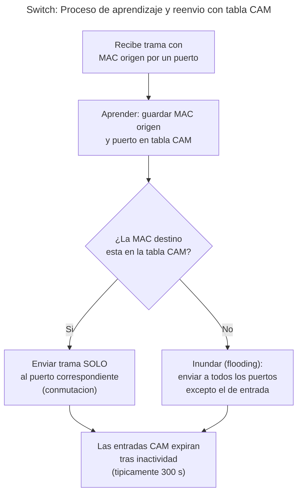
```mermaid
---
title: "Switch: Proceso de aprendizaje y reenvio con tabla CAM"
---
flowchart TD
    A["Recibe trama con\nMAC origen por un puerto"] --> B["Aprender: guardar MAC origen\ny puerto en tabla CAM"]
    B --> C{"¿La MAC destino\nesta en la tabla CAM?"}
    C -- "Si" --> D["Enviar trama SOLO\nal puerto correspondiente\n(conmutacion)"]
    C -- "No" --> E["Inundar (flooding):\nenviar a todos los puertos\nexcepto el de entrada"]
    D --> F["Las entradas CAM expiran\ntras inactividad\n(tipicamente 300 s)"]
    E --> F
```

La tabla CAM es una **memoria volátil** (RAM especializada): se pierde al apagar el switch y se reconstruye automáticamente.

#### 5.4.2 Switch capa 2 vs switch capa 3

| Característica | Switch capa 2 | Switch capa 3 |
|:---|:---:|:---:|
| Capa OSI | 2 (Enlace) | 2 + 3 (Enlace + Red) |
| Direccionamiento | MAC | MAC + IP |
| Enrutamiento | No | Sí (inter-VLAN routing) |
| Tabla | CAM (MACs) | CAM + tabla de enrutamiento |
| Uso típico | Conmutación dentro de una VLAN | Enrutamiento entre VLANs, core de red |

#### 5.4.3 VLANs en switches

Una **VLAN** (Virtual LAN) segmenta lógicamente la red en dominios de broadcast independientes. Cada VLAN es un dominio de broadcast separado; el tráfico entre VLANs requiere enrutamiento (router o switch capa 3).

**Tipos de VLAN**:

| Tipo | Descripción |
|:---|:---|
| **VLAN basada en puertos** (port-based) | Cada puerto físico se asigna a una VLAN; el tráfico sale sin etiqueta (untagged) hacia el dispositivo final |
| **VLAN etiquetada** (tagged, IEEE 802.1Q) | La trama Ethernet lleva una etiqueta de 4 bytes con el VLAN ID (VID); permite transportar múltiples VLANs en un mismo enlace (trunk) |

> **Dato de examen**: los tipos de VLAN son **basadas en puertos** y **etiquetadas** (no "marcadas" ni "gestionadas"). El estándar de etiquetado es **IEEE 802.1Q**.

**Etiqueta 802.1Q** (4 bytes insertados en la trama Ethernet):

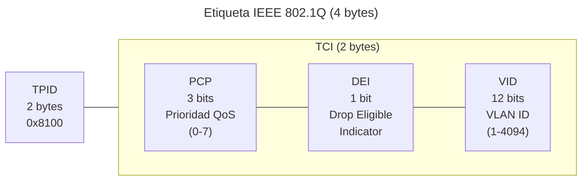
```mermaid
---
title: "Etiqueta IEEE 802.1Q (4 bytes)"
---
flowchart LR
    TPID["TPID\n2 bytes\n0x8100"]
    subgraph TCI["TCI (2 bytes)"]
        direction LR
        PCP["PCP\n3 bits\nPrioridad QoS\n(0-7)"]
        DEI["DEI\n1 bit\nDrop Eligible\nIndicator"]
        VID["VID\n12 bits\nVLAN ID\n(1-4094)"]
        PCP --- DEI
        DEI --- VID
    end
    TPID --- TCI
```

- **TPID**: Tag Protocol Identifier (0x8100 indica trama 802.1Q).
- **PCP**: Priority Code Point (prioridad QoS, 0-7).
- **DEI**: Drop Eligible Indicator.
- **VID**: VLAN Identifier (12 bits → hasta 4094 VLANs distintas, de la 1 a la 4094).

**Puertos trunk vs access**:

| Puerto | Descripción | Uso |
|:---:|:---|:---|
| **Access** | Pertenece a una sola VLAN; tráfico sin etiqueta | Conexión a dispositivos finales (PCs, impresoras) |
| **Trunk** | Transporta tráfico de múltiples VLANs etiquetadas | Conexión entre switches, o entre switch y router/AP multi-SSID |

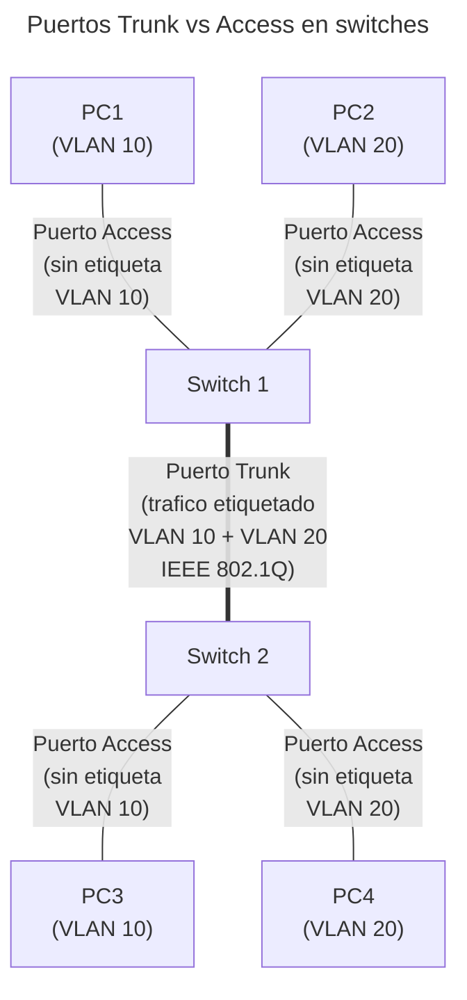
```mermaid
---
title: "Puertos Trunk vs Access en switches"
---
flowchart TD
    SW1["Switch 1"]
    SW2["Switch 2"]

    PC1["PC1\n(VLAN 10)"]
    PC2["PC2\n(VLAN 20)"]
    PC3["PC3\n(VLAN 10)"]
    PC4["PC4\n(VLAN 20)"]

    PC1 ---|"Puerto Access\n(sin etiqueta\nVLAN 10)"| SW1
    PC2 ---|"Puerto Access\n(sin etiqueta\nVLAN 20)"| SW1
    SW1 ===|"Puerto Trunk\n(trafico etiquetado\nVLAN 10 + VLAN 20\nIEEE 802.1Q)"| SW2
    SW2 ---|"Puerto Access\n(sin etiqueta\nVLAN 10)"| PC3
    SW2 ---|"Puerto Access\n(sin etiqueta\nVLAN 20)"| PC4
```

> **Caso de examen**: si un AP Wi-Fi autónomo publica 3 SSID asociados a 3 VLANs distintas, el puerto del switch al que se conecta **debe configurarse en modo trunk**. Un puerto en modo access solo puede transportar una VLAN.

**Tráfico multicast en switch L2 sin IGMP Snooping**: sin gestión de multicast activa, el switch trata el tráfico multicast como desconocido y lo **inunda a todos los puertos de la misma VLAN** (no a las otras VLANs, ya que cada VLAN es un dominio de broadcast independiente).

#### 5.4.4 Seguridad Wi-Fi

| Protocolo | Cifrado | Estado |
|:---:|:---:|:---:|
| **WEP** (1997) | RC4 estático | Obsoleto y vulnerable; retirado en 2004 |
| **WPA** (2003) | RC4 + TKIP | Solución transitoria; también obsoleto |
| **WPA2** (2004, IEEE 802.11i) | **AES + CCMP** | Estándar robusto; obligatorio para Wi-Fi Alliance |
| **WPA3** (2018) | AES + SAE | Mayor protección; resistente a ataques de diccionario |

> **Dato de examen**: el algoritmo de cifrado fundamental de **WPA2** es **AES** (con el protocolo CCMP). TKIP es de WPA (no WPA2). WEP usa RC4 y es inseguro.

**WPA2-Enterprise**: requiere un servidor **RADIUS** y el protocolo **IEEE 802.1X** (autenticación por EAP-PEAP, EAP-TLS, etc.). Los dispositivos sin soporte para 802.1X no pueden conectarse.

### 5.5 Router (Enrutador)

Dispositivo de **capa 3 (Red)**. Conecta redes distintas y dirige los paquetes de datos entre ellas consultando su tabla de enrutamiento (basada en direcciones IP).

- **Enrutamiento estático**: las rutas se configuran manualmente por el administrador.
- **Enrutamiento dinámico**: las rutas se ajustan automáticamente mediante protocolos de enrutamiento (OSPF, BGP, RIP...).

**Función clave**: el router **separa dominios de broadcast**. El tráfico broadcast (ej.: 255.255.255.255) no traspasa el router. Para que clientes en subredes diferentes alcancen un servidor DHCP, se configura un **DHCP Relay Agent** (ip helper-address en Cisco), que convierte el broadcast DHCP en un unicast dirigido al servidor.

### 5.6 Gateway (Pasarela)

Opera en **todas las capas OSI** (generalmente capa 7). Traduce protocolos entre redes de arquitecturas distintas, permitiendo la comunicación entre sistemas incompatibles.

- **Uso**: conectar una LAN con Internet; interconectar redes con protocolos diferentes.

### 5.7 Tabla resumen: dispositivos por capa OSI

| Dispositivo | Capa OSI | Función principal | Dominio colisión | Dominio broadcast |
|:---:|:---:|:---|:---:|:---:|
| Repetidor | 1 | Regenera señal | No separa | No separa |
| Hub | 1 | Replica a todos los puertos | No separa | No separa |
| Bridge | 2 | Filtra por MAC entre segmentos | Separa | No separa |
| Switch L2 | 2 | Conmuta por MAC (tabla CAM) | Separa | No separa (sí con VLANs) |
| Switch L3 | 2+3 | Conmuta + enruta | Separa | Separa (por VLAN) |
| Router | 3 | Enruta por IP entre redes | Separa | Separa |
| Gateway | Todas | Traduce protocolos | Separa | Separa |

---

## 6. Centros de Proceso de Datos (CPD) y el Estándar TIA-942

Un **Centro de Proceso de Datos (CPD)** o **Data Center** es una instalación física que alberga la infraestructura informática y de comunicaciones de una organización (servidores, almacenamiento, equipos de red, sistemas de alimentación y refrigeración). Este tema aparece en examen casi siempre preguntando por los niveles TIER: hay que saber nombrarlos, saber sus disponibilidades y no confundir el estándar TIA-942 con otros como ISO-27001.

### 6.1 Estándar TIA-942

El estándar **[ANSI/TIA-942](https://tiaonline.org/products-and-services/tia942certification/ansi-tia-942-standard/)** (*Telecommunications Infrastructure Standard for Data Centers*), publicado por la **Telecommunications Industry Association (TIA)**, define la clasificación de los CPD en cuatro niveles de disponibilidad denominados **TIER**.

> **Dato de examen**: el estándar que clasifica los Data Centers en 4 niveles TIER es **TIA-942** (no ISO-27001 —que es gestión de seguridad de la información— ni el inexistente "TIE-924").

### 6.2 Niveles TIER del estándar TIA-942

| TIER | Nombre | Disponibilidad | Indisponibilidad máx./año | Características principales |
|:---:|:---|:---:|:---:|:---|
| **Tier I** | Básico | 99,671 % | 28,8 h | Sin redundancia; una sola ruta de distribución; componentes de capacidad única |
| **Tier II** | Componentes redundantes | 99,741 % | 22 h | Componentes redundantes (N+1) pero una sola ruta de distribución; incluye UPS y generador |
| **Tier III** | **Mantenimiento concurrente** | 99,982 % | **1,57 h** | Múltiples rutas de distribución; mantenimiento planificado sin interrumpir el servicio; doble línea eléctrica (90 % por separado) |
| **Tier IV** | **Tolerante a fallos** | 99,995 % | 0,4 h | Sistemas completamente duplicados activo/activo al 100 %; soporta cualquier fallo sin caída del servicio |

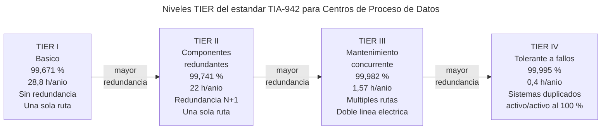
```mermaid
---
title: "Niveles TIER del estandar TIA-942 para Centros de Proceso de Datos"
---
flowchart LR
    T1["TIER I\nBasico\n99,671 %\n28,8 h/anio\nSin redundancia\nUna sola ruta"]
    T2["TIER II\nComponentes\nredundantes\n99,741 %\n22 h/anio\nRedundancia N+1\nUna sola ruta"]
    T3["TIER III\nMantenimiento\nconcurrente\n99,982 %\n1,57 h/anio\nMultiples rutas\nDoble linea electrica"]
    T4["TIER IV\nTolerante a fallos\n99,995 %\n0,4 h/anio\nSistemas duplicados\nactivo/activo al 100 %"]

    T1 -->|"mayor\nredundancia"| T2
    T2 -->|"mayor\nredundancia"| T3
    T3 -->|"mayor\nredundancia"| T4
```

> **Dato de examen clave**:
> - **Tier 3 = Mantenimiento concurrente** (se puede mantener sin interrumpir el servicio) → 1,57 h de indisponibilidad/año.
> - **Tier 4 = Tolerante a fallos** → 0,4 h de indisponibilidad/año.
> - Tier 3 es el más común en Data Centers empresariales de nivel medio-alto.

**Características de un CPD Tier III** (aparece en el banco de preguntas):
- Permite realizar cualquier actividad planificada sobre cualquier componente de suministro eléctrico y climatización **sin interrupción**.
- Dispone de doble línea de distribución eléctrica, con capacidad para operar al menos al 90 % con cada una por separado.
- Tiempo máximo de indisponibilidad al año: **1,57 horas**.

### 6.3 Servidores Blade

Un **servidor blade** es un módulo de servidor de formato delgado diseñado para insertarse en un **chasis compartido** (*blade enclosure*). Cada blade contiene:

- **Microprocesador(es)**, **memoria RAM**, **buses** internos (PCIe) y **almacenamiento** (discos locales o acceso a SAN).

Lo que **no** incluye el blade individualmente (se comparte en el chasis):
- Fuentes de alimentación (compartidas y redundantes en el chasis).
- Sistemas de refrigeración (ventiladores del chasis).
- Switches de red y SAN integrados como módulos del chasis.

> **Dato de examen**: Un servidor blade contiene **microprocesador, memoria, buses y almacenamiento**. La fuente de alimentación es compartida y pertenece al chasis, no al blade individual.

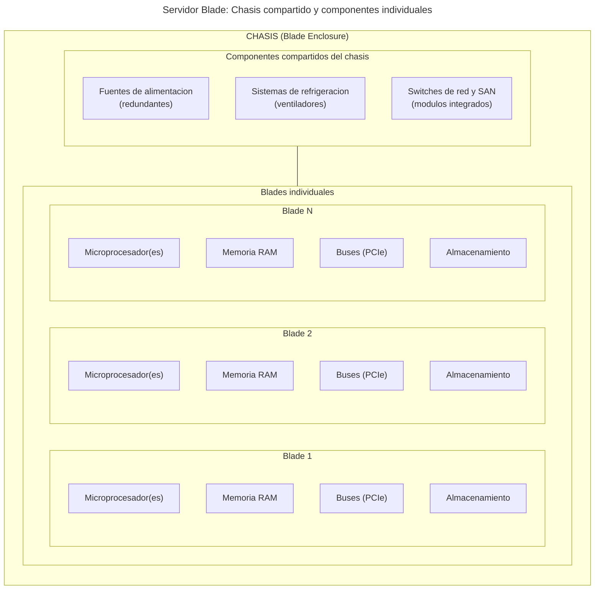
```mermaid
---
title: "Servidor Blade: Chasis compartido y componentes individuales"
---
flowchart TD
    subgraph CHASSIS["CHASIS (Blade Enclosure)"]
        direction TD
        subgraph SHARED["Componentes compartidos del chasis"]
            PSU["Fuentes de alimentacion\n(redundantes)"]
            COOL["Sistemas de refrigeracion\n(ventiladores)"]
            NET["Switches de red y SAN\n(modulos integrados)"]
        end

        subgraph BLADES["Blades individuales"]
            direction LR
            subgraph B1["Blade 1"]
                B1CPU["Microprocesador(es)"]
                B1RAM["Memoria RAM"]
                B1BUS["Buses (PCIe)"]
                B1STO["Almacenamiento"]
            end
            subgraph B2["Blade 2"]
                B2CPU["Microprocesador(es)"]
                B2RAM["Memoria RAM"]
                B2BUS["Buses (PCIe)"]
                B2STO["Almacenamiento"]
            end
            subgraph B3["Blade N"]
                B3CPU["Microprocesador(es)"]
                B3RAM["Memoria RAM"]
                B3BUS["Buses (PCIe)"]
                B3STO["Almacenamiento"]
            end
        end

        SHARED --- BLADES
    end
```

**Ventajas**: alta densidad de servidores por U de rack, gestión centralizada, reducción de cableado, escalabilidad rápida.

---

## Resumen para el examen

- **Tipos de red por extensión**: PAN (1-10 m, Bluetooth) → LAN (edificio, Ethernet/Wi-Fi) → CAN (campus) → MAN (ciudad, fibra óptica) → WAN (mundial, satélite/fibra).
- **Una LAN**: no requiere Internet, no tiene límite de 10 m, conecta dispositivos en un área geográfica limitada.
- **Topologías**: estrella = nodos conectados punto a punto al switch central (más usada hoy); anillo = datos circulan en un sentido; bus = cable central compartido; malla = máxima redundancia, máximo coste.
- **En topología estrella**: si el dispositivo central falla, toda la red queda inactiva.
- **Métodos de acceso**: CSMA/CD (Ethernet, detecta colisiones) vs CSMA/CA (Wi-Fi, evita colisiones); Token Ring (pase de testigo en anillo, sin colisiones pero vulnerable a pérdida del token).
- **Expansión de espectro en 802.11**: **DSSS** (Direct Sequence Spread Spectrum). Usado en 802.11b.
- **Capa OSI de los dispositivos**: repetidor y hub = capa 1; bridge y switch L2 = capa 2; router y switch L3 = capa 3.
- **Switch vs hub**: el switch envía la trama solo al puerto del destinatario (tabla CAM); el hub la envía a todos los puertos. La tabla CAM del switch es **volátil** (RAM).
- **Dirección MAC**: 48 bits = **6 bloques de 2 caracteres hexadecimales**. Los 3 primeros bytes = OUI (fabricante); los 3 últimos = identificador del dispositivo.
- **Router**: separa dominios de broadcast. El tráfico **broadcast no traspasa el router**.
- **Dominio de colisión**: separado por switches (cada puerto = un dominio). **Dominio de broadcast**: separado por routers (o por VLANs).
- **VLANs**: tipos = **basadas en puertos** (untagged) y **etiquetadas** (tagged, IEEE 802.1Q). Puerto **trunk** = múltiples VLANs etiquetadas; puerto **access** = una sola VLAN sin etiqueta. Un AP con múltiples SSID/VLANs requiere puerto **trunk**.
- **Tráfico multicast en switch L2 sin IGMP Snooping**: se inunda a **todos los puertos de la misma VLAN**.
- **WPA2 = AES (CCMP)**. WPA = TKIP. WEP = RC4 (obsoleto e inseguro).
- **IEEE 802.11ax = Wi-Fi 6**. IEEE 802.11ac = Wi-Fi 5. IEEE 802.11be = Wi-Fi 7.
- **Comité WLAN = IEEE 802.11** (no 802.15 —Bluetooth/ZigBee— ni 802.16 —WiMAX—).
- **WPA2-Enterprise**: requiere servidor RADIUS + IEEE 802.1X. Dispositivos sin soporte 802.1X no pueden conectarse.
- **TIA-942**: estándar que clasifica los CPD en 4 niveles TIER (no ISO-27001). **Tier I = Básico; Tier II = Componentes redundantes; Tier III = Mantenimiento concurrente (1,57 h/año); Tier IV = Tolerante a fallos (0,4 h/año)**.
- **Servidor blade**: contiene microprocesador + memoria + buses + almacenamiento. La fuente de alimentación es del chasis, no del blade.
- **Bonding Linux modo 0 (balance-rr)**: distribuye paquetes round-robin; el cuello de botella de un flujo individual sigue siendo el enlace más lento (ej.: FastEthernet de 100 Mbps limita el rendimiento por PC, no la capacidad agregada del servidor).
- **Transmisión síncrona**: mayor eficiencia, reloj compartido, tramas continuas. **Asíncrona**: bits de inicio/parada por byte, más fácil de implementar, mayor overhead.

---

## Preguntas frecuentes en exámenes

El banco de preguntas de este tema tiene 21 preguntas. El análisis de los subtemas más repetidos revela lo siguiente:

### Subtema 1: Dispositivos de interconexión y capas OSI (4 preguntas)

Es el subtema más examinado. Las preguntas atacan en dos variantes:

1. **¿En qué capa OSI opera el switch?** → Capa 2 (enlace de datos). Los switches tradicionales (Layer 2) usan la tabla CAM para reenviar tramas por MAC. Los hubs y repetidores son capa 1. Los routers son capa 3.

2. **Diferencia switch vs hub** → La diferencia fundamental es que el switch envía la trama únicamente al puerto del destinatario, mientras que el hub la envía a todos los puertos excepto el de origen. El hub no almacena MACs; el switch sí (tabla CAM volátil).

### Subtema 2: Estándar TIA-942 y niveles TIER (3 preguntas)

Tres preguntas distintas, todas con trampa en la nomenclatura:

- ¿Qué estándar clasifica los CPD en TIER? → **TIA-942** (no ISO-27001, no TIE-924).
- ¿Qué es Tier 3? → **Mantenimiento concurrente** (no "tolerante a errores", que es Tier 4; no "básico", que es Tier 1).
- Dado un CPD con 1,57 h de indisponibilidad y doble línea eléctrica mantenible sin interrupción, ¿qué Tier es? → **Tier 3**.

### Subtema 3: VLANs y puertos trunk/access (2 preguntas)

- **Tipos de VLAN implantables**: basadas en puertos y/o **etiquetadas** (no "marcadas", no "gestionadas").
- **AP con múltiples SSID y VLANs**: el puerto del switch debe configurarse en **modo trunk** (un puerto access solo transporta una VLAN).

### Subtema 4: Estándares Wi-Fi IEEE 802.11 (3 preguntas)

- **IEEE 802.11ax = Wi-Fi 6** (no Wi-Fi 5 = 802.11ac, no Wi-Fi 7 = 802.11be).
- **Comité WLAN = IEEE 802.11** (no 802.15 = WPAN/Bluetooth, no 802.16 = WMAN/WiMAX).
- **Expansión del espectro**: **DSSS** (no DMSS ni OFSS, que son inventados).

### Subtema 5: Seguridad Wi-Fi WPA2 (1 pregunta)

- **Cifrado fundamental de WPA2 = AES** (protocolo CCMP). TKIP es de WPA (no WPA2). WEP usa RC4 y es inseguro.

### Subtema 6: Definición y características de una LAN (1 pregunta)

- Una LAN **no requiere Internet** para funcionar.
- Una LAN **no tiene límite de 10 metros** (eso es una PAN/Bluetooth).
- Una LAN conecta dispositivos dentro de un área geográfica limitada.

### Subtema 7: Dirección MAC (1 pregunta)

- MAC = 48 bits = **6 bloques de 2 caracteres hexadecimales** (no 5x3, no 8x2).

### Subtema 8: Broadcast y dominios (1 pregunta)

- El **tráfico broadcast no traspasa el router** (el router separa dominios de broadcast).
- El tráfico unicast sí traspasa el router.
- El tráfico multicast puede o no traspasar el router según la configuración.

### Subtema 9: Tráfico multicast en switch L2 (1 pregunta)

- Sin IGMP Snooping, el tráfico multicast se inunda a todos los puertos de la **misma VLAN** (no a todas las VLANs, no solo a los suscritos).

### Subtema 10: Bonding Linux (1 pregunta)

- Con 5 PCs FastEthernet (100 Mbps) y un servidor con 2 GbE en bonding modo 0 (balance-rr), el rendimiento individual máximo por PC es **100 Mbps** (cuello de botella = la tarjeta FastEthernet del PC, no el bonding del servidor).

---

## Referencias

- [IEEE 802.3 — Ethernet Standard](https://www.ieee802.org/3/) — Estándar oficial IEEE para Ethernet cableada (10BASE-T, 100BASE-TX, 1000BASE-T, etc.)
- [IEEE 802.11 — WLAN Standard](https://www.ieee802.org/11/) — Estándar oficial IEEE para redes inalámbricas (Wi-Fi)
- [IEEE 802.1Q — VLAN Tagging](https://en.wikipedia.org/wiki/IEEE_802.1Q) — Estándar de etiquetado de VLANs
- [TIA-942 — Telecommunications Infrastructure Standard for Data Centers](https://tiaonline.org/products-and-services/tia942certification/ansi-tia-942-standard/) — Clasificación TIER de Centros de Proceso de Datos
- [CSMA/CD — Carrier Sense Multiple Access with Collision Detection](https://en.wikipedia.org/wiki/Carrier-sense_multiple_access_with_collision_detection) — Wikipedia
- [VLAN — Virtual LAN](https://en.wikipedia.org/wiki/VLAN) — Wikipedia
- [Wi-Fi Protected Access — WPA/WPA2/WPA3](https://www.wi-fi.org/discover-wi-fi/security) — Wi-Fi Alliance: seguridad Wi-Fi
- [Cisco — Inter-Switch Link and IEEE 802.1Q Frame Format](https://www.cisco.com/c/en/us/support/docs/lan-switching/8021q/17056-741-4.html) — Documentación oficial Cisco sobre trunking 802.1Q
- [TIA-942 — Wikipedia](https://en.wikipedia.org/wiki/TIA-942) — Resumen del estándar TIA-942 y niveles TIER
- [DSSS — Direct Sequence Spread Spectrum](https://en.wikipedia.org/wiki/Direct-sequence_spread_spectrum) — Wikipedia
- [OSI Model](https://en.wikipedia.org/wiki/OSI_model) — Modelo de referencia OSI de 7 capas
- [Blade Server](https://en.wikipedia.org/wiki/Blade_server) — Wikipedia: servidores blade
